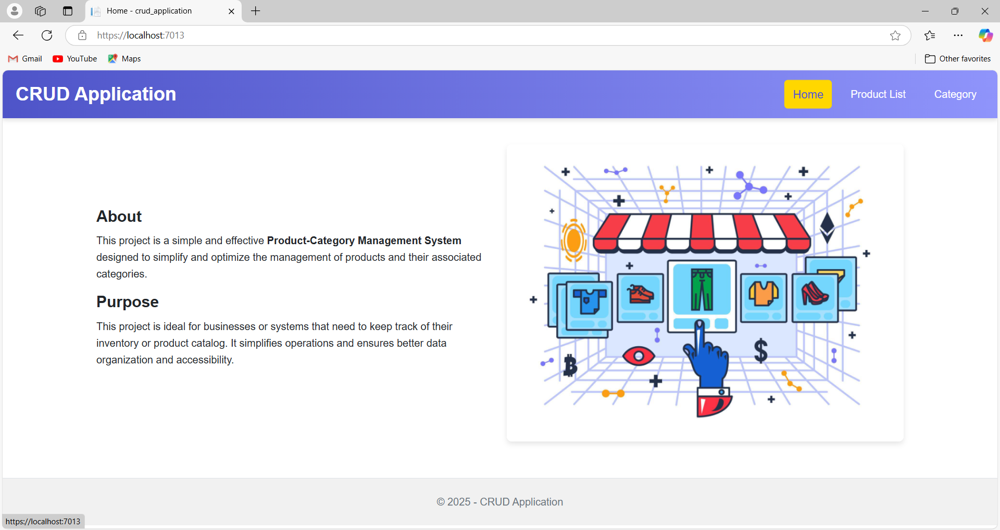
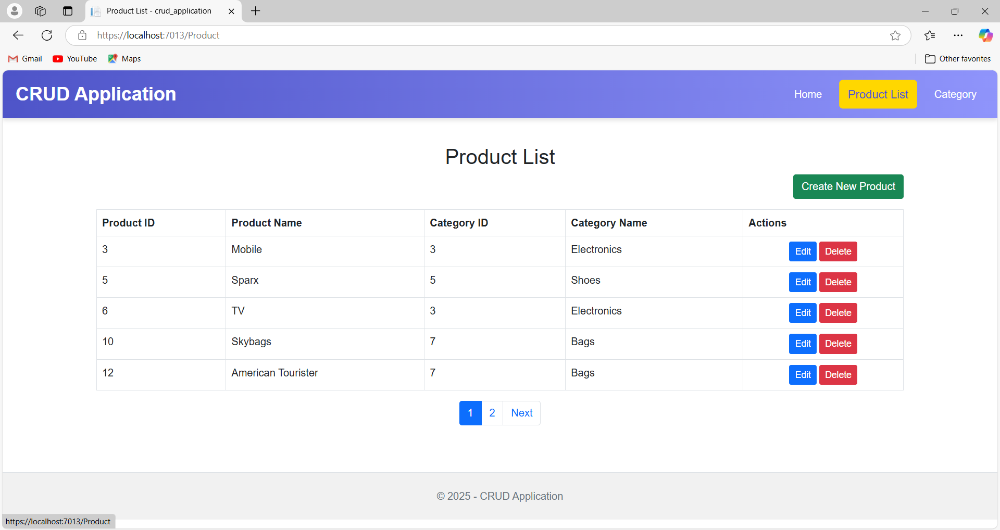
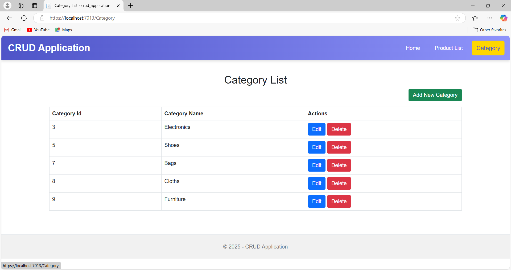

# Product Management System

## Overview
This is a simple **Product-Category Management System** built with **ASP.NET MVC** and **Entity Framework Core** (Code-First Approach). It allows users to manage products and categories efficiently.

---

## Features
- **Category Management**: CRUD operations for categories.
- **Product Management**: CRUD operations for products, linked to categories.
- **Server-Side Pagination**: Efficient pagination for large datasets.

---

## Screenshots

### Home Page

### Product List

### Category Management

---

